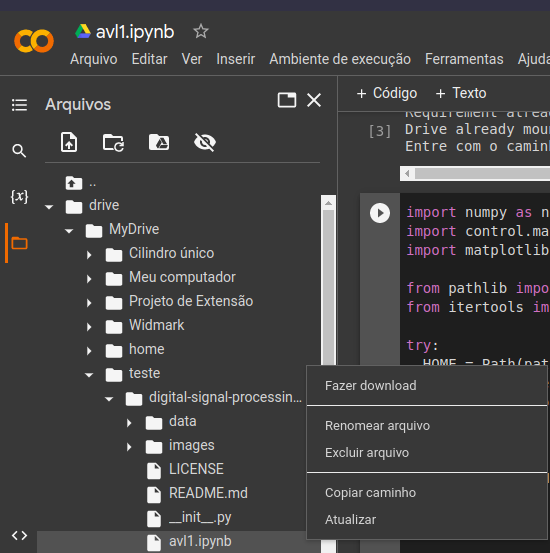

# digital-signal-processing
Implementações utilizadas para a disciplina de EMB5645 - Processamento Digital de Sinais (PDS)

Foco no estudo de controladores digitais e filtragem de sinais

INSTRUÇÕES PARA RODAR NO DRIVE:
--------------------------------

Suba a pasta descompactada no drive e abra o arquivo avl1.ipynb com o aplicativo Google Colaboratory. 

Descomente as linhas da primeira célula do script, espere a instalação da biblioteca de controle terminar e entre com o caminho para o arquivo .ipynb.

O caminho para o arquivo pode ser obtido navegando pela árvore de pastas do google drive e clicando com o botão direito do mouse em cima do arquivo desejado.

INSTRUÇÕES PARA RODAR NO VSCODE:
--------------------------------

Abra o Vscode na pasta e, caso não tenha, instale as extensões necessárias para python e jupyter-notebook.

Recomendo baixar os packs extension de cada um para garantir a boa funcionalidade do código.

Após isso, vá no terminal e instale os pacotes necessários usando a seguinte linha de comando: 

pip install &lt;package&gt;

Terminada a instalação o código pode ser executádo sem problemas. 

Contato para dúvidas:
widmarkkaue.s.c@gmail.com

